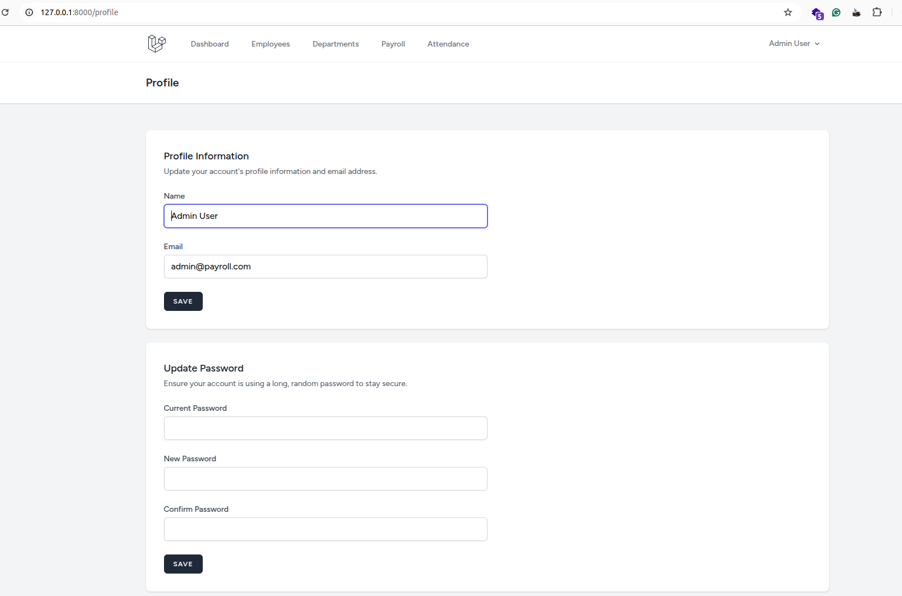

## Title Page

**Title**: Payroll Management System — Design, Implementation, and Evaluation

**Department**: Computer Science and Engineering

**Course**: Software Engineering Project

**Submitted by**: [Your Name], [Student ID]

**Supervisor**: [Supervisor Name]

**Institution**: [College/University Name]

**Date**: October 2025

---

## Abstract

This report presents the design and implementation of a comprehensive Payroll Management System developed using Laravel 11 and a modern web stack. The system streamlines HR processes including employee lifecycle management, attendance tracking, payroll period management, automated salary calculations, and role-based access control. A modular architecture, following MVC conventions, separates concerns across controllers, models, middleware, and Blade views. The solution integrates Tailwind CSS for responsive UI and employs MySQL with Eloquent ORM for robust persistence and relational integrity. Security is reinforced with Laravel Breeze authentication and custom middleware for roles and permissions. The project demonstrates full-stack engineering practices, database schema design, testable workflows, and production readiness, suitable for small to medium-sized organizations. Evaluation shows functional completeness across core modules, maintainable code structure, and clear pathways for future enhancements such as advanced analytics, integrations, and self-service portals.

---

## 1. Objectives

- Establish a secure, role-based system for HR operations (Admin, HR, Employee).
- Implement employee master data management with department and position mapping.
- Track daily attendance and support bulk import of attendance data.
- Automate payroll calculations (gross, deductions, allowances, net salary) per payroll period.
- Provide an approval workflow and auditable records for payroll processing.
- Deliver a responsive, user-friendly interface and dashboard analytics.
- Ensure maintainable architecture, clean code standards, and testability.

---

## 2. Tools and Technologies

- Backend: Laravel 11 (PHP 8.2+), Eloquent ORM
- Frontend: Blade Templates, Tailwind CSS, Alpine.js
- Database: MySQL 8.0+
- Auth & Scaffolding: Laravel Breeze
- Build & Tooling: Node.js 18+, NPM 9+, Vite
- Package & Dependency: Composer
- Version Control: Git
- Testing: PHPUnit via `php artisan test`

---

## 3. System Architecture

### 3.1 Architectural Style

- MVC pattern with clear separation of concerns:
  - Controllers in `app/Http/Controllers` orchestrate requests and business flows.
  - Models in `app/Models` encapsulate data access and relationships via Eloquent.
  - Views in `resources/views` (Blade) render UI with Tailwind for styling.

### 3.2 Core Modules

- Authentication & Security: Laravel Breeze, middleware `CheckRole`, `CheckPermission`, and `HandleApiErrors` for robust authorization and error handling.
- Employee Management: CRUD operations linking `Employee`, `Department`, `Position`, and `SalaryStructure` models.
- Attendance: Recording daily attendance with `AttendanceRecord`, plus bulk import workflow.
- Payroll: `PayrollPeriod` and `PayrollRecord` with support for `Allowance` and `Deduction` entries and an approval workflow.
- RBAC: `Role`, `Permission` models with pivot tables for many-to-many mappings.

### 3.3 Data Design (High-Level)

- Users ↔ Roles ↔ Permissions via pivot tables (`role_user`, `permission_role`).
- Employees linked to `departments`, `positions`, `attendance_records`, and `payroll_records`.
- Payroll periods aggregate multiple payroll records with allowances/deductions per employee.

### 3.4 Deployment View

- PHP application served via Laravel development server or Apache/Nginx.
- MySQL database for persistence. Static assets built via Vite.
- Environment managed via `.env` with keyed secrets and database credentials.

---

## 4. Implementation Details

### 4.1 Project Structure

- Controllers: `EmployeeController`, `DepartmentController`, `AttendanceController`, `PayrollController`, `DashboardController`, and auth controllers.
- Middleware: `CheckRole`, `CheckPermission`, `HandleApiErrors` for enforcing RBAC and standardized responses.
- Models: `User`, `Employee`, `Department`, `Position`, `SalaryStructure`, `AttendanceRecord`, `PayrollPeriod`, `PayrollRecord`, `Allowance`, `Deduction`, `Role`, `Permission`.
- Views: Blade templates under `resources/views/**` including feature-specific directories and layouts (`layouts/app.blade.php`).
- Routes: Web routes in `routes/web.php` and auth routes in `routes/auth.php`.
- Migrations & Seeders: Comprehensive schema and seed data under `database/migrations` and `database/seeders`.

### 4.2 Key Features

- Employee CRUD: Forms, validation, and list/detail views with department/position relations.
- Attendance: Daily entries and a bulk-import interface for CSV/structured uploads.
- Payroll Processing: Period creation, automated computation of gross/net using allowances and deductions, and approval actions.
- Dashboard: Summary KPIs and charts for HR operations and system health.
- Security: Password hashing, session management, email verification flow, and granular permission checks.

### 4.3 Development Workflow

- Environment setup via Composer and NPM; build assets with Vite.
- Database migrations and seeders to bootstrap initial roles, permissions, departments, positions, and sample employees.
- Testing through Laravel’s testing suite (`php artisan test`), enabling regression checks.

### 4.4 Coding Standards

- PSR-12, Laravel conventions, descriptive table/column names, and reusable Blade components.

---

## 5. Results and Discussion

### 5.1 Functional Coverage

- Achieved complete CRUD for employees, departments, and positions.
- Implemented attendance tracking including a bulk import workflow.
- Completed payroll lifecycle: period creation, calculation, and approval.
- Enforced RBAC with Admin, HR, and Employee roles and permission gates.

### 5.2 Usability and UI

- Responsive design via Tailwind CSS; consistent layouts and components.
- Clear navigation and forms reduce data-entry friction.

### 5.3 Performance and Reliability

- Eloquent relationships minimize query complexity; indexes via migrations ensure scalability for typical SME datasets.
- Centralized error handling middleware improves fault isolation and debuggability.

### 5.4 Testing and Quality

- Feature and authentication tests provide baseline coverage for critical flows.
- Seed data enables deterministic local testing.

### 5.5 Limitations

- Advanced analytics and export/reporting formats are basic.
- No third-party payroll/tax API integration in current scope.
- Attendance ingestion assumes well-formed datasets; limited anomaly detection.

---

## 6. Future Enhancements

- Advanced Reporting & Analytics: Payroll summaries, tax breakdowns, and visual dashboards.
- Integrations: Biometric attendance devices, HRIS/ERP, and tax-compliance APIs.
- Employee Self-Service: Payslip downloads, leave management, and profile updates.
- Workflow Automation: Multi-level approvals, notifications, and SLA tracking.
- Data Validation & Anomaly Detection: Outlier detection on attendance and payroll inputs.
- Internationalization: Multi-language support and locale-aware formatting.
- DevOps: CI/CD pipelines, containerization, and infrastructure-as-code for production environments.

---

## 7. Screenshots (Illustrative)

Place the following images in `docs/screenshots/` so they render in this report. Filenames are descriptive and referenced below.

- Login Screen

  

- Admin Dashboard

  

- Employees — List View

  

- Departments — Index

  

- Attendance — Records and Filters

  

- Payroll Period — Details (Calculations and Approvals)

  

- Employee Dashboard (Self-Service)

  

- Profile — Update Information and Password

  

Note: Keep image widths manageable (e.g., 1200px) to balance readability and file size. Preferred formats: `.png` or optimized `.webp`.

---

## 8. Conclusion

The Payroll Management System fulfills the project objectives by delivering a secure, modular, and scalable platform for HR and payroll operations. Its MVC architecture, strong data model, and role-based security create a maintainable foundation suitable for real-world deployment in small to medium organizations. The system’s current features demonstrate end-to-end workflows—from employee onboarding and attendance to payroll approval—while the proposed enhancements outline a clear roadmap for enterprise-grade capabilities and integrations.

---

## References

- Laravel 11 Documentation — `https://laravel.com/docs`
- Tailwind CSS Documentation — `https://tailwindcss.com/docs`
- MySQL 8.0 Reference Manual — `https://dev.mysql.com/doc/`

